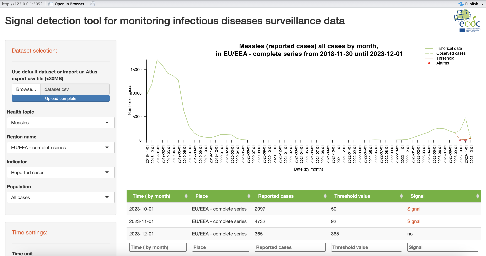
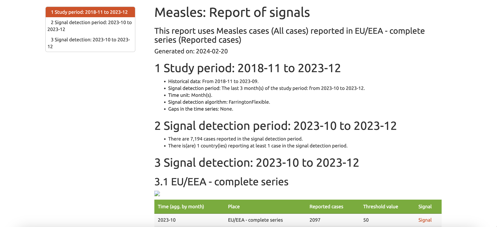

# Measles Tracker

## General data considerations
All data are subject to continuous verification and may change based on retrospective updates in order to accurately reflect trends, changes in national case definitions, and/or reporting practices. Caution should be used when comparing published data longitudinally.

Case definitions, testing strategies, reporting practices, and lag times (e.g. time to case notification and time to reporting of deaths) differ between countries. These factors, among others, influence the data presented and may lead to misinterpretation.

Please visit https://atlas.ecdc.europa.eu/public/index.aspx for a detailed description of the data in the file: <b>Measles_Europe.csv</b>. 

Please visit https://www.who.int/teams/immunization-vaccines-and-biologicals/immunization-analysis-and-insights/surveillance/monitoring/provisional-monthly-measles-and-rubella-data for a detailed description of the data in the file: <b>Measles_Global.csv</b>. 

Please visit https://immunizationdata.who.int/pages/coverage/mcv.html for a detailed description of the data in the file: <b>Measles_vaccination_coverage_Global.csv</b>.  

Please visit https://www.epicentro.iss.it/morbillo/bollettino for a detailed description of the data in the folder: <b>Italy</b>. 

## EpiSignalDetection tool

The 'EpiSignalDetection' package allows the user to explore time series for signal detection. 
It is specifically designed to detect possible outbreaks using infectious disease surveillance data 
at the European Union / European Economic Area (EU/EEA) or country level (Source: https://www.ecdc.europa.eu/en/publications-data/episignaldetection-tool). 

Our team has developed an open-access database to monitor measles globally. Through this initiative, the 'EpiSignalDetection' package can also be used for other countries around the world and not just for EU/EEA. In this way we will be able to have a broader view of the measles epidemiological situation and intervene more promptly to prevent and manage any outbreaks. 

The package includes:

* __Signal Detection tool (Fig.1)__ an interactive 'shiny' application 
in which the user can import external data and perform basic signal detection analyses;
* __An automated report (Fig.2)__ in HTML format, presenting the results 
of the time series analysis in tables and graphs. This report can also be 
stratified by population characteristics (see 'Population' variable).

 
 

__Fig.1 Signal detection tool for monitoring infectious diseases in TESSy__

 
 
 

__Fig.2 Report of alarms__

