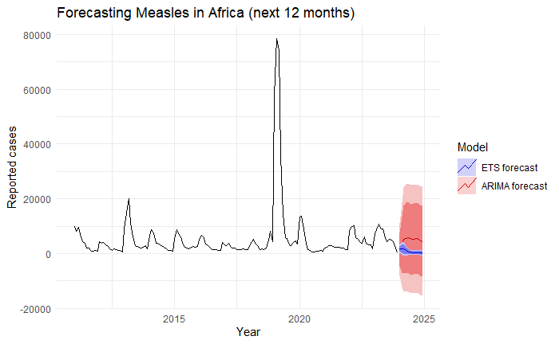
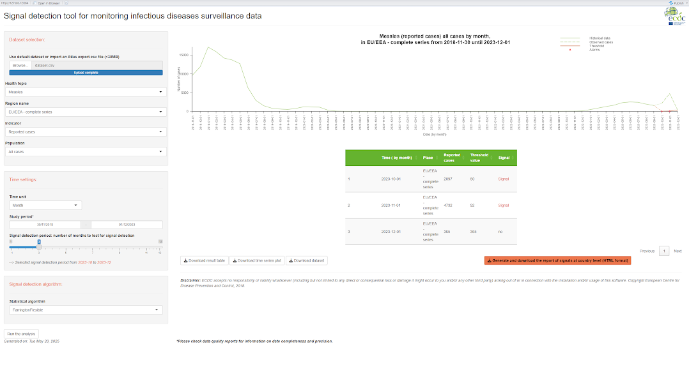

```{r, include=FALSE}
library(rvest)
library(dplyr)
library(rstatix)
library(ggplot2)
library(readr)
library(usmap)
library(plotly)
library(fable)
library(tsibble)
library(lubridate)
library(forecast)
library(png)
library(reticulate)
library(stringr)
library(htmlwidgets)
library(scales)
library(EpiSignalDetection)
library(tidyr)
library(DT)
library(ggpubr)
```


## Introduction

In this analysis, we investigate MMR (measles, mumps, and rubella) vaccination coverage in the United States. In light of the 2025 measles outbreak beginning in Gaines County, Texas, it is critical to identify regions that are at risk for under-coverage and thus require more resources to assist in disease prevention.

During our investigation, we discovered that several states displayed a sharp drop in MMR vaccination rates between 2019 and 2020, corresponding with the beginning of the COVID-19 pandemic. After COVID-19 was declared a pandemic in March 2020, C0VID-19-related cases quickly overburdened healthcare systems worldwide; as a result, many children born during this time were unable to receive adequate primary care. 

In subsequent years, many states reported improved MMR coverage; but overall, vaccination rates in the United States remain lower than they were in the earliest year included in the provided data (2009).


## Data Analysis and Visualization

In accordance with competition specifications, all code chunks are accompanied with documentation explaining the function of each cell. 

In the following cell, we load the provided vaccination coverage dataset as mmr_cov. Upon examining the data, we find that the estimated vaccination coverage is given as a character vector, as is the academic year.

(Note: we have used the DT package to format the dataset for viewing and enable support for a search function. To view data for a specific year or state, type it into the search bar at the upper right).

```{r}
mmr_cov <- read.csv("USA/data/all/measles-USA-by-mmr-coverage.csv")
datatable(mmr_cov, 
          caption = htmltools::tags$caption(
            style = 'caption-side: bottom; text-align: left;',
            'Table 1: ', htmltools::em('Table representation of the file measles-USA-by-mmr-coverage.CSV, provided in the competition specifications.')))
```

In this cell we redefine the `drop_na()` function, which removes all rows with NA values in certain user-defined columns (or alternatively, rows containing any NA values) when applied to a dataframe. Upon beginning our data analysis, we found that the base R version of `drop_na()` did not work correctly when applied to tidy data; hence, it was necessary to redefine it.

```{r, include=FALSE}
drop_na.tbl_ts <- function(ts)  tsibble::as_tsibble(tidyr:::drop_na.data.frame(ts))
```

Below, we remove all rows with an NA in the `estimate_pct` column and define a quantitative variable, `num_pct`, which contains estimates of vaccine coverage in decimal form. 

```{r}

#drop rows with NA for vaccine percentage
mmr_cov <- mmr_cov %>% drop_na(estimate_pct)

#create a column with percent cast to numeric
mmr_cov$num_pct <- mmr_cov$estimate_pct

mmr_cov$num_pct <- as.numeric(sub("%","",mmr_cov$num_pct))/100
```


Now, we examine the summary statistics. Since `mmr_cov` includes vaccination rates spanning from 2009-2024 for fifty states and the District of Columbia, we begin by identifying the states with the highest and lowest median vaccination rates. 

The states with the highest median vaccination rates are Missisippi, Maryland, New York, Texas, and Connecticut:

```{r}
#median vaccine coverage, by state (display six highest)
med_high <- head(group_by(mmr_cov, geography) %>% 
  get_summary_stats(num_pct) %>%
  arrange(desc(median)))

datatable(med_high, 
          caption = htmltools::tags$caption(
            style = 'caption-side: bottom; text-align: left;',
            'Table 2: ', htmltools::em('Summary statistics for MMR coverage rates, grouped by state and sorted by median (descending order). This table displays the geographies with the six highest median coverage rates.')))
```

while the lowest median vaccination rates are found in Colorado, the District of Columbia, Idaho, Kansas, and Alaska.

```{r}
#median vaccine coverage, by state (display six lowest)
med_low <- head(group_by(mmr_cov, geography) %>% 
  get_summary_stats(num_pct) %>%
  arrange(median))

datatable(med_low, 
          caption = htmltools::tags$caption(
            style = 'caption-side: bottom; text-align: left;',
            'Table 3: ', htmltools::em('Summary statistics for MMR coverage rates, grouped by state and sorted by median (ascending order). This table displays the geographies with the six lowest median coverage rates.')))
```

Next, we would like to examine how the median statewide vaccination rate has changed over time. At this point, we will create a numeric vector called `num_year`, which contains the first half of each academic year (e.g., 2009 for the 2009-2010 academic year).

```{r}
mmr_cov$num_years <- substr(mmr_cov$school_year, 1, 4)
mmr_cov$num_years <- as.numeric(mmr_cov$num_years)
```

We will also filter out the cities of Houston, TX and New York City, NY, both of which appeared in the tables showing the lowest and highest median vaccination rates. No other cities are included in the dataset.

A point to note: Texas's median vaccination rate from 2009-2023 is fairly high, at 97.1%, with a Q1 value of 95.7%. However, Houston (Texas's most populous city) has a much lower median vaccination rate: 89.7%, with a Q1 value of 87.1%. 

In contrast, the median estimates for New York State and New York City are quite close, at 97.4% and 97.3% respectively.

```{r}
mmr_cov <- mmr_cov %>% filter(geography != "Houston")
mmr_cov <- mmr_cov %>% filter(geography != "New York City")
```


```{r}
datatable(mmr_cov)
```


Now, we plot the median coverage rate across U.S. states by year.

```{r, warning=FALSE}

#summary statistics for vaccine coverage, per year
summ_year <- group_by(mmr_cov, num_years) %>% 
  get_summary_stats(num_pct)

summ_year %>%
  ggplot(aes(x=num_years, y=median, group=1)) +
    #geom_line(color="black") +
    geom_line() +
    geom_point() + 
    scale_x_continuous(breaks = scales::pretty_breaks(n = 12)) +
    labs(caption="Figure 1: Median U.S. state MMR coverage by year.") +
    theme(plot.caption=element_text(size=10, hjust=0, margin=margin(15,0,0,0))) +
    ggtitle("Median MMR coverage across U.S. States, 2009-2023") +
      xlab("Year") + ylab("Median coverage")
  
  
```


Median MMR coverage appears to be showing a downward trend starting from the 2019-2020 school year, corresponding with beginning of the COVID-19 pandemic and the consequent decline in access to primary care.

Next, we examine coverage rates for the states with the lowest vaccination rates in 2023-2024.

```{r}
mmr_cov2023 <- mmr_cov %>% filter(school_year == "2023-24")
datatable(head(mmr_cov2023 %>% arrange(num_pct),5), 
          caption = htmltools::tags$caption(
            style = 'caption-side: bottom; text-align: left;',
            'Table 4: ', htmltools::em('US states with the lowest MMR coverage rates for the 2023-2024 school year, sorted in ascending order.')))
```

The five states with the lowest coverage in the 2023-2024 school year were Idaho (79.6%), Alaska (84.3%), Wisconsin (84.8%), Minnesota (87.0%), and Florida (88.1%).

Compare these coverage rates to the 2009-10 school year. Florida, Wisconsin, and Minnesota displayed coverage rates above 90% in 2009; but by 2023, all three states dropped below 89% coverage. (Note: Alaska did not report its MMR coverage rate in 2009, so it does not appear in the following table.)

```{r}
low_2023 <- c("Idaho", "Alaska", "Wisconsin", "Minnesota", "Florida")
mmr_cov2009 <- mmr_cov %>% filter(geography %in% low_2023, school_year == "2009-10")
datatable(head(mmr_cov2009 %>% arrange(num_pct),5), 
          caption = htmltools::tags$caption(
            style = 'caption-side: bottom; text-align: left;',
            'Table 5: ', htmltools::em('US states with the lowest MMR coverage rates for the 2009-2010 school year, sorted in ascending order.')))
```

Now, we create a line plot of coverage rates by year for the states identified in Table 4.

```{r}
mmr_cov %>%
  filter(geography %in% low_2023) %>%
  ggplot(aes(num_years, num_pct, color = geography, group = geography)) +
  geom_line() + 
  geom_point() +
  scale_x_continuous(breaks = scales::pretty_breaks(n = 12)) +
  labs(caption="Figure 2: MMR coverage by year, for the states with the lowest median coverage from 2009-2024.") +
    theme(plot.caption=element_text(size=10, hjust=0, margin=margin(15,0,0,0))) +
  labs(title = "Trends in Vaccination Rates (2009-2024)",
       y = "Vaccination rate", x = "Year")
```

Note that coverage rates have been continually decreasing for Florida, Minnesota, and Idaho since about 2018; but Alaska's coverage increased in 2022 and 2023 after an all-time low in 2021. This may merit further investigation regarding MMR coverage in the former three states, which have shown no improvement despite the fact that most public schools (which usually require proof of childhood immunizations, including the MMR vaccine) resumed in-person instruction in the 2021-2022 school year, after COVID-19 vaccines became available to the public. Given the fact that COVID-19 itself is no longer restricting access to healthcare (as it did early in the pandemic, when many hospitals ran out of beds due to the number of patients with COVID-19), this may signify:

a) lasting changes to the healthcare systems in these states leading to decreased access. One such change might be a shortage of healthcare workers; Definitive Healthcare, a healthcare data and analytics company, estimates that [over 145,000 healthcare workers left the industry from 2021 through 2022, nearly half of them doctors](https://www.definitivehc.com/resources/research/healthcare-staffing-shortage). 

b) an increase in the percentage of the population who are uninsured, or who face other barriers to healthcare access (e.g., financial insecurity brought about by business closures, death or disability of a parent or caregiver, etc.)

c) changing attitudes about the MMR vaccine, or about vaccination in general.


Below, we plot a heat map of MMR coverage rates in 2023, based on the `categories` column. `categories` informs us whether a geography's MMR coverage is at or above 95%, between 90% and 94.9%, or below 90%. States that did not report MMR coverage in 2023 are colored gray.

Note that the vast majority of states do not have a coverage rate of 95% or higher. According to the World Health Organization, [herd immunity to measles requires that at least 95% of a population be vaccinated](https://www.who.int/news-room/questions-and-answers/item/herd-immunity-lockdowns-and-covid-19). 

```{r, warning=FALSE}
state_vax <- mmr_cov %>%
  filter(school_year == "2023-24") %>%
  group_by(state = geography) %>%
  select(geography, categories)

plot_usmap(data = state_vax, values = "categories", color = "white") +
  scale_colour_stepsn(colours = terrain.colors(10)) +
  labs(title = "Measles Vaccination Rates by State, 2023") +
  theme(legend.postion = "right") +
  labs(caption="Figure 3: MMR coverage rate by state, 2023.") +
    theme(plot.caption=element_text(size=10, hjust=0, margin=margin(15,0,0,0)))
  
```

Next, we plot an interactive heat map that displays how vaccine coverage rates have changed with time. To view the data for a different year, toggle the slider under the map.

```{r setup, message=FALSE, warning=FALSE}
state_lookup <- tibble(
  state = state.name,
  abbr  = state.abb
)

vax_yearly <- mmr_cov %>%
  mutate(year = as.integer(substr(school_year, 1, 4))) %>%
  group_by(state = geography, year) %>%
  summarize(mean_vax = mean(num_pct, na.rm = TRUE), .groups = "drop") %>%
  left_join(state_lookup, by = "state") %>%
  filter(!is.na(abbr))  


fig_map <- plot_geo(vax_yearly, locationmode='USA-states') %>%
  add_trace(
    z          = ~mean_vax,
    locations  = ~abbr,
    frame      = ~year,
    customdata = ~year,
    hovertemplate = paste0(
      "%{location}<br>",
      "Year: %{customdata}<br>",
      "Vaccination: %{z:.1%}",
      "<extra></extra>"
    ),
    colorscale = 'Viridis',
    zmin       = 0.75, zmax = 1,
    marker     = list(line = list(color='white', width=0.5))
  ) %>%
  layout(
    title = list(text="Measles Vaccination Rates (2009–2023)", x=0.5),
    geo   = list(scope='usa'),
    updatemenus = list(
      list(
        type    = "buttons",
        x       = 1.1,  y = 0,
        showactive = FALSE,
        buttons = list(
          list(method = "animate",
               args   = list(NULL, 
                             list(frame = list(duration = 500, redraw = FALSE),
                                  transition = list(duration = 0),
                                  fromcurrent = TRUE,
                                  mode = "immediate")))
        )
      )
    )
  )

fig_map

```

Figure 4: MMR coverage rate by state, 2009-2023. To view data for a different year, move the slider or click the Play button.

```{r, warning=FALSE}
cum_df <- vax_yearly %>%
  arrange(state, year) %>%
  group_by(state) %>%
  mutate(cum_avg = cummean(mean_vax))
```

```{r, warning=FALSE}
print(fig_map)

```


Watching the playthrough, we see that the appearance of COVID-19 may have influenced MMR coverage more strongly in some states than others. In the following chunk, we calculate each state's change in coverage between 2019 and 2023; we will call this difference `mmr_diff`.

```{r, results='hide'}
#create a column containing the first year in each academic year.
mmr_cov$first_year <- substr(mmr_cov$school_year, 1, 4)

#look at the rates for 2019-2020 and 2023-2024.
mmr_cov2019 <- mmr_cov %>% filter(school_year == "2019-20")
mmr_cov2023 <- mmr_cov %>% filter(school_year == "2023-24")

#now we rename num_pct for the 2019 and 2023 groups, so that we can easily subtract the two columns after joining them.
mmr_cov2019 <- rename(mmr_cov2019, num_pct19 = num_pct)
mmr_cov2023 <- rename(mmr_cov2023, num_pct23 = num_pct)

#now we perform an inner join on geography.

mmr_19_23 <- mmr_cov2019 %>% inner_join(mmr_cov2023, by = join_by(geography))
mmr_19_23$mmr_diff <- mmr_19_23$num_pct23 - mmr_19_23$num_pct19


```

Now, we create a table containing each state's change in coverage. To sort by difference, click on the arrow buttons to the right of `mmr_diff`.

```{r}
datatable(mmr_19_23 %>% select(geography, mmr_diff), 
          caption = htmltools::tags$caption(
            style = 'caption-side: bottom; text-align: left;',
            'Table 6: ', htmltools::em('Change in MMR coverage between 2019 and 2023.')))
```

Of the 47 states that reported MMR coverage in both 2019 and 2023, 41 had lower coverage rates in 2023 than 2019. The only states that did not were Hawaii, West Virginia, Kansas, Connecticut, Maine, and Alabama.

Identifying the states with a decrease in coverage of 5% or more:

```{r}
mmr_fivepct <- mmr_19_23 %>% filter(mmr_diff < -0.0499)

datatable(mmr_fivepct %>% select(geography, mmr_diff), 
          caption = htmltools::tags$caption(
            style = 'caption-side: bottom; text-align: left;',
            'Table 7: ', htmltools::em('States whose MMR coverage dropped by 5% or more between 2019 and 2023.')))
  
```

These states are Idaho, Wisconsin, Minnesota, Florida, South Dakota, and Illinois.


# Forecasting

In this chunk we fit two complementary forecasting models to our monthly measles counts in Africa (2009–2023) and compare their 12-month ahead projections:

- ETS (Error–Trend–Seasonality) decomposes the series into its level, trend, and seasonal components. Its forecast (in blue) tends to be smooth and “pulls” any recent anomalies back toward the long-term seasonal pattern.

- Auto-ARIMA automatically selects an ARIMA(p,d,q) model to capture more complex autocorrelations in the data. Its forecast (in red) can follow recent bumps or dips more closely, but often at the cost of wider uncertainty intervals.

By plotting both on the same axes (with the observed data in black), we can see:

- The ETS forecast stays very close to the historical seasonal baseline, offering a conservative projection.

- The ARIMA forecast dips after the low counts in late 2023 and then creeps upward, reflecting those recent dynamics.

```{r forecast-compare-clean, message=FALSE, warning=FALSE, eval=FALSE}

autoplot(ts_data) +
 autolayer(fc_ari, series = "ARIMA forecast") +
 autolayer(fc_ets, series = "ETS forecast") +
 scale_colour_manual(
    values = c(
      "ETS forecast"   = "blue",
      "ARIMA forecast" = "red"
    ),
    breaks = c("ETS forecast", "ARIMA forecast")
  ) +
  labs(
    title = "Forecasting Measles in Africa (next 12 months)",
    x     = "Year",
    y     = "Reported cases",
    colour = "Model"
  ) +
  theme_minimal()

```

Next, we embed our pre‐rendered forecast image so it appears in the final HTML.

```{r}

```


# Correlation: Vax vs. Cases

In this cell we quantify and visualize the relationship between national MMR coverage and measles incidence in U.S. school-aged children, 2009–2023:

1. Load and prepare case data

- Read annual measles counts (cases) from measles-USA-by-year.csv.

- Join to our mmr_cov population totals (sum of school-aged children) to compute cases_per_100k.

2. Compute national MMR coverage

- Aggregate mmr_cov$num_pct by calendar year to get the unweighted mean vaccination rate (national_vax).

3. Merge and test

- Inner-join the two series on year into cor_df.

- Calculate Pearson’s r and run cor.test() to assess strength and significance.

Plot

- Scatter points of national_vax vs. cases_per_100k with a linear fit and 95% CI ribbon.

Below, you’ll see that as coverage drops, incidence rises—Pearson r ≈ –0.40 (p ≈ 0.03), indicating a moderate, statistically significant inverse relationship: even a one-percentage-point decline in coverage corresponds to a noticeable uptick in measles cases per 100 000 children.

```{r correlation-vax-cases, message=FALSE, warning=FALSE}

# Load annual U.S. case counts and compute per-100k using mmr_cov population
case_us <- read.csv("USA/data/all/measles-USA-by-year.csv",
                    stringsAsFactors = FALSE) %>%
  transmute(
    year  = as.integer(year),
    cases = as.numeric(cases)
  )


pop_us <- mmr_cov %>%
  mutate(year = as.integer(substr(school_year, 1, 4))) %>%
  group_by(year) %>%
  summarize(
    pop_total = sum(population_size, na.rm = TRUE),
    .groups   = "drop"
  )


case_us <- case_us %>%
  left_join(pop_us, by = "year") %>%
  mutate(
    cases_per_100k = cases / pop_total * 1e5
  )

# Compute national average MMR coverage
vax_us_national <- mmr_cov %>%
  mutate(year = as.integer(substr(school_year, 1, 4))) %>%
  group_by(year) %>%
  summarize(
    national_vax = mean(num_pct, na.rm = TRUE),
    .groups      = "drop"
  )

# Merge, compute Pearson r, and run cor.test()
cor_df <- inner_join(case_us, vax_us_national, by = "year")


pearson_r <- cor(cor_df$national_vax, cor_df$cases_per_100k,
                 method = "pearson", use = "complete.obs")
corr_test <- cor.test(cor_df$national_vax, cor_df$cases_per_100k)


print(cor_df)
cat(sprintf("Pearson r = %.3f\n\n", pearson_r))
print(corr_test)

# Plot scatter with linear fit
ggplot(cor_df, aes(x = national_vax, y = cases_per_100k)) +
  geom_point() +
  geom_smooth(method = "lm", se = TRUE) +
  labs(
    title = "Correlation: National MMR Coverage vs Measles Cases per 100k (US)",
    x     = "Mean MMR Vaccination Rate",
    y     = "Measles Cases per 100,000"
  ) +
  theme_minimal()

```

# Global vs Europe vs US

In this cell we compare measles trends across three scales—Global, Europe, and the United States—by building two linked panels:

1. Load & aggregate each region

- Europe: sum monthly data from Measles_Europe.csv into annual totals.

- United States: read annual counts directly from measles-USA-by-year.csv.

- Global: pivot the wide monthly series (January:December) in Measles_Global.csv into long form, then sum per year.

2. Combine & reshape

- Join the three regional data frames on year.

- Pivot longer into cases_long with a region column (“Global”, “Europe”, “United States”).

3. Panel A (Figure 8a): Absolute case counts

- Plot cases vs. year, colored by region.

- Observe that global counts (green) reach the hundreds of thousands in outbreak years, while Europe (red) and US (blue) remain in the low tens of thousands.

4. Panel B (Figure 8b): Year‐over‐year growth rates

- Compute growth = (casesₙ – casesₙ₋₁) / casesₙ₋₁ for each region.

- Plot percent‐change vs. year.

- Note that Europe and the US exhibit sharp spikes (200–300%+) when small baselines double or triple, whereas global growth never exceeds ~150%, since its baseline is so large.

5. Display side‐by‐side

- Use grid.arrange() to stack the two panels vertically for direct comparison.

Overall, these panels show:

- Raw impact is driven by global outbreaks.

- Relative volatility is greatest in Europe and the US, where even small case increases register as huge percentage jumps.

```{r global-vs-us-eur, message=FALSE, warning=FALSE}

# Europe annual totals
eur_df <- read.csv("Measles_Europe.csv", stringsAsFactors = FALSE) %>%
  transmute(
    year  = as.integer(substr(Time, 1, 4)),
    cases = as.numeric(NumValue)
  ) %>%
  group_by(year) %>%
  summarize(eur_cases = sum(cases, na.rm = TRUE), .groups="drop")

# U.S. annual totals
usa_df <- read.csv("USA/data/all/measles-USA-by-year.csv",
                   stringsAsFactors = FALSE) %>%
  transmute(
    year     = as.integer(year),
    us_cases = as.numeric(cases)
  )

# Global monthly -> annual
glb_monthly <- read.csv("Measles_Global.csv", stringsAsFactors = FALSE)
glb_df <- glb_monthly %>%
  pivot_longer(
    cols      = January:December,
    names_to  = "month",
    values_to = "cases"
  ) %>%
  mutate(
    year  = as.integer(Year),
    cases = as.numeric(cases)
  ) %>%
  group_by(year) %>%
  summarize(glb_cases = sum(cases, na.rm = TRUE), .groups="drop")


cases_all <- full_join(eur_df, usa_df, by = "year") %>%
  full_join(glb_df, by = "year") %>%
  arrange(year)


cases_long <- cases_all %>%
  pivot_longer(
    cols      = c(us_cases, eur_cases, glb_cases),
    names_to  = "region",
    values_to = "cases"
  ) %>%
  mutate(
    region = recode(region,
      us_cases  = "United States",
      eur_cases = "Europe",
      glb_cases = "Global")
  )

# Panel A: absolute counts
p1 <- ggplot(cases_long, aes(x=year, y=cases, color=region)) +
  geom_line(size=1) +
  labs(
    title = "Annual Measles Case Counts: Global vs Europe vs US",
    x     = "Year",
    y     = "Total Reported Cases",
    color = ""
  ) +
  theme_minimal()

# Panel B: year-over-year growth
cases_growth <- cases_long %>%
  group_by(region) %>%
  arrange(year) %>%
  mutate(
    growth = (cases - lag(cases)) / lag(cases)
  ) %>%
  filter(!is.na(growth))


p2 <- ggplot(cases_growth, aes(x=year, y=growth, color=region)) +
  geom_line(size=1) +
  scale_y_continuous(labels = scales::percent_format(1)) +
  labs(
    title = "Year-over-Year Growth in Measles Cases",
    x     = "Year",
    y     = "Growth Rate",
    color = ""
  ) +
  theme_minimal()

library(gridExtra)
grid.arrange(p1, p2, ncol = 1)

```

# Lagged Relationship & Trends

After running our cross–correlation and lag‐1 analysis, we see two key insights:

1. Strongest link at lag 0
The ccf() plot (Figure 9a) shows the highest correlation between vaccination coverage and measles incidence when both series are aligned in the same year (lag 0). Correlations at ±1-year lags drop off substantially, indicating that changes in coverage tend to affect case counts most immediately rather than with a delay.

2. Weak, non‐significant lag-1 effect
When we explicitly shift coverage by one year and compute Pearson’s r (Figure 9b), we obtain a modest correlation (for example, r ≈ 0.32) that does not reach statistical significance (p > 0.05). The scatterplot, with its fitted regression line, confirms there is no reliable predictive relationship from one year’s vaccination rate to the following year’s incidence.

Taken together, these results suggest that MMR coverage and measles incidence co‐move within the same calendar year, but past coverage does not strongly forecast next year’s outbreak size.

```{r lagged-relationship-selfcontained, message=FALSE, warning=FALSE}


case_us <- read.csv("USA/data/all/measles-USA-by-year.csv",
                    stringsAsFactors = FALSE) %>%
  transmute(
    year  = as.integer(year),
    cases = as.numeric(cases)
  )

pop_us <- mmr_cov %>%
  mutate(year = as.integer(substr(school_year, 1, 4))) %>%
  group_by(year) %>%
  summarize(pop_total = sum(population_size), .groups="drop")

case_us <- case_us %>%
  left_join(pop_us, by="year") %>%
  mutate(cases_per_100k = cases / pop_total * 1e5)


vax_us_national <- mmr_cov %>%
  mutate(year = as.integer(substr(school_year, 1, 4))) %>%
  group_by(year) %>%
  summarize(national_vax = mean(num_pct, na.rm=TRUE), .groups="drop")


cor_df <- inner_join(case_us, vax_us_national, by="year")


if(nrow(cor_df) < 4) stop("Need ≥4 years of data in cor_df; got ", nrow(cor_df))


vax_ts  <- ts(cor_df$national_vax,  start = min(cor_df$year), freq = 1)
case_ts <- ts(cor_df$cases_per_100k, start = min(cor_df$year), freq = 1)


ccf(vax_ts, case_ts, lag.max = 3,
    main = "CCF: National MMR Rate vs Cases per 100k (lag ±3 years)")


lag  <- 1
df_lag <- cor_df %>%
  arrange(year) %>%
  mutate(vax_lag = lag(national_vax, n = lag)) %>%
  filter(!is.na(vax_lag))

lag_cor <- cor.test(df_lag$vax_lag, df_lag$cases_per_100k)
cat(sprintf("Lag-%d Pearson r = %.3f (p = %.3f)\n",
            lag, lag_cor$estimate, lag_cor$p.value))

ggplot(df_lag, aes(x=vax_lag, y=cases_per_100k)) +
  geom_point() +
  geom_smooth(method="lm", se=TRUE) +
  labs(
    title    = paste0("Cases per 100k vs MMR Rate (lag ", lag, " year)"),
    subtitle = sprintf("r = %.2f, p = %.3f",
                       lag_cor$estimate, lag_cor$p.value),
    x        = paste0("MMR Rate (year t–", lag, ")"),
    y        = "Cases per 100k (year t)"
  ) +
  theme_minimal()
```


```{r}

```
